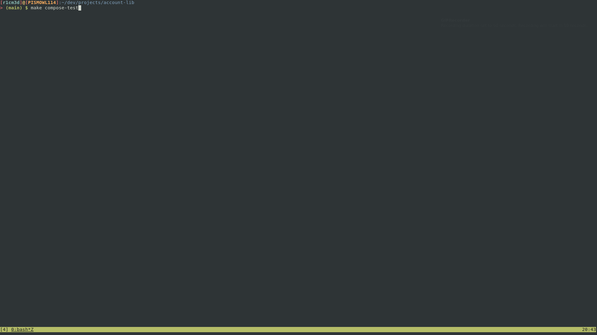

# account-lib by Ricardo Medeiros da Costa Junior


[](./LICENSE)

**TL;DR:**
```shell
make compose-test
```


## Prerequisites
[](https://www.docker.com/)
[](https://github.com/docker/compose/releases)
[](https://www.gnu.org/software/make/)
[](https://www.gnu.org/software/bash/)

## Table of Contents
* [TL;DR](#account-lib)
* [Prerequisites](#prerequisites)
* [About the Project](#about-the-project)
* [Testing](#testing)
* [Setup local environment](#setup-local-envinroment)
* [Documentation](#documentation)
* [Clean](#clean)

## About The Project

This Go client library abstract an Account HTTP API that is simulated using this [docker-compose](./docker-compose.yaml).
Aiming to be simple as possible, this project follows the same structure as 
[decimal](https://github.com/shopspring/decimal) library. It also applies the
patterns found in [Uber Style Guide](https://github.com/uber-go/guide/blob/master/style.md). This guide has 
useful insights about of writing Go code in general.

### Testing
This project has one hundred percentage of code coverage. It could be checked with the following commands:
#### Unit tests
```shell
make unit-test
```
It will run unit tests in the local environment. It is necessary to have Go installed.
#### Integration tests
```shell
make it-test
```
It will run integration tests in the local environment. It is necessary to have Go installed and run dependencies. See
[make](#setup-local-environment) and [make install](#setup-local-environment).


#### All tests
```shell
make test
```
This is going to apply fmt and run both unit and integration tests.

### Setup Local Environment
Build application and run tests in a containerized environment is the easy way to run it isolated from environment noise.
Although this is quite useful, sometimes is necessary debug the application or even debug an integration test. In this case, run the follow
command pipeline:
```shell
./configure && make && make install
```

[configure](scripts/configure.sh) script will certificate that your environment is able to assemble the application locally. `make` target will
assemble the application with `go build` running `go vet`, `go fmt` and `go lint` before it. For the last, `make install`
will run [docker-compose](docker-compose.yaml) with all dependencies.
### Documentation
This library has the basic documentation for use it, to see it in your browser:
```shell
make doc
```
Open your browser, it will be running in localhost address at `6060` TCP port.
### Clean
To remove all docker containers downloaded and installed by this project, run:
```shell
make clean
```
This script will run [clean.sh](scripts/clean.sh) which is a basic shell script with a couple of docker commands.
